# Сайт интернет-магазина

### Оглавление

- [Описание](#описание)
- [Превью](#превью)
- [Инструкция по запуску](#инструкция-по-запуску)

---

## Описание

В процессе изучения Django я написал код для сайта интернет-магазина по продаже одежды, обуви и аксессуаров.

На сайте есть:

1. Заглавная страница с возможными скидками.
2. Страница с каталогом товара, который можно сортировать в зависимости от категории, а также пагинация.
3. Личный кабинет пользователя с корзиной. В нём можно поменять имя, фамилию, аватар,
   и указаны имя пользователя и адрес электронной почты
4. После нажатия на кнопку `Оформление заказа` в личном кабинете,
   открывается страница с указанием имени и фамилии получателя, адреса электронной почты и адреса доставки.
   Справа от полей для заполнения отображаются названия товаров в корзине, их количество по товару и общее,
   и их стоимость за все единицы одного товара и сумма всей покупки.
5. Дальше открывается страница платёжной системы Stripe, где нужно ввести данные карты для оплаты
   и дублируется информация о покупках из пункта **4**.
6. После успешной оплаты открывается страница с уведомлением о завершённой покупке.
7. Информация о покупке сохраняется в списке заказов, а из личного кабинета удаляется.
8. Подробную информацию о покупке можно посмотреть нажав на кнопку `просмотреть`.

#### Стек

- Python v3.11
- Django v4.2
- psycopg2 v2.9
- Redis v5.2 для кэширования и Celery
- Celery v5.4 для отложенных запросов
- isort - форматтер
- flake8 - линтер

Для удобства переноса виртуального окружения создал
[файл](https://github.com/Ghost845/django-store/blob/d5e85ece8cf9a4c96e3d0ae9eb96247f344a9a3b/requirements.txt)
с необходимыми пакетами и версиями.

---

## Превью

|                  Примеры страниц                   |
|:--------------------------------------------------:|
|              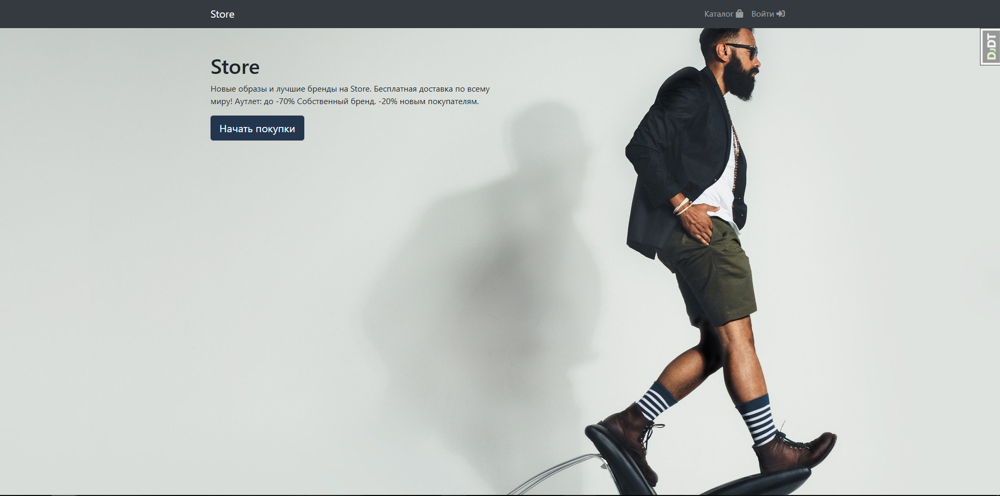              |
|           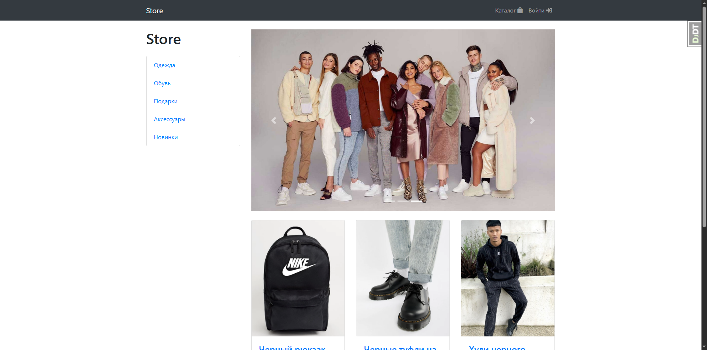           |
| 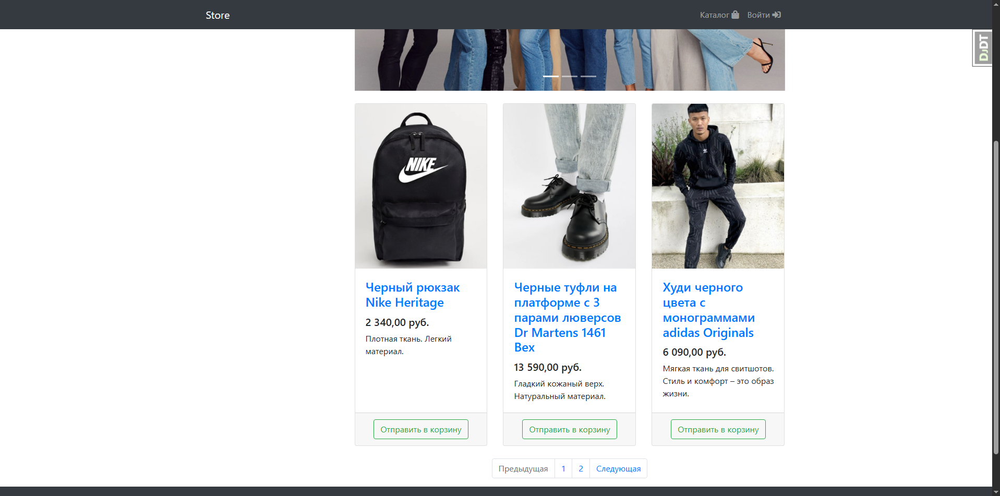 |
|  |
|     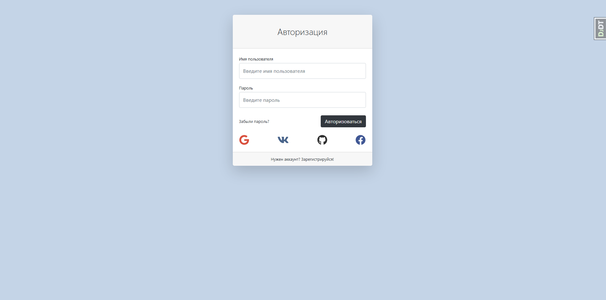     |
|      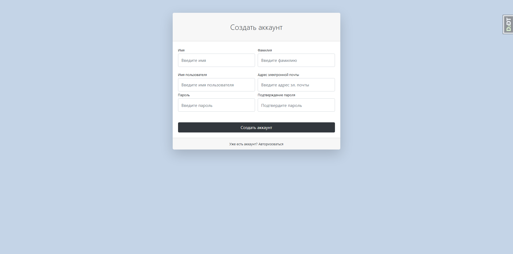      |
|           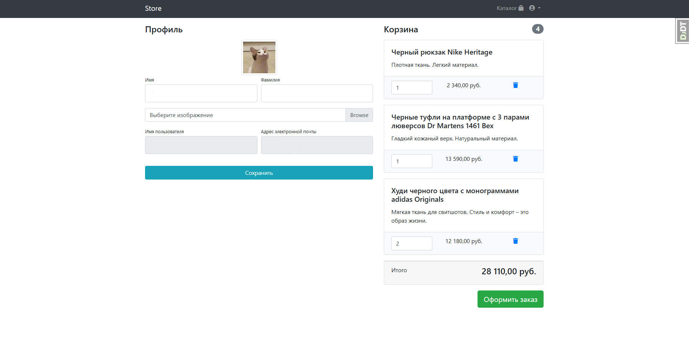           |
|          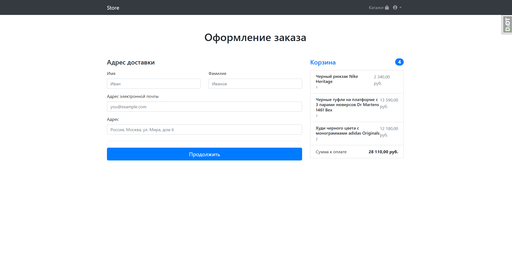          |
|           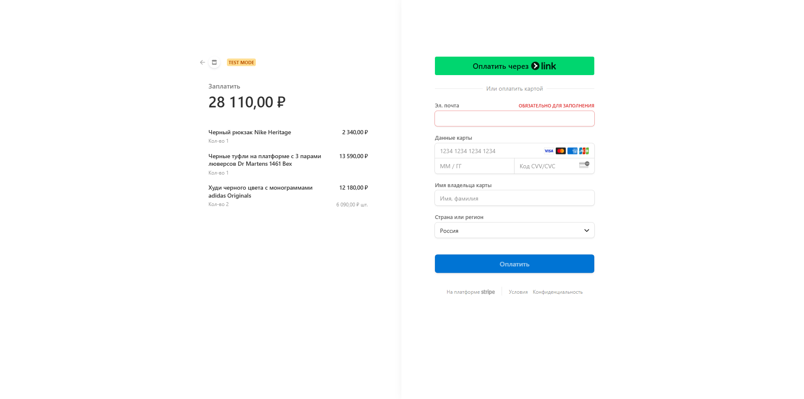           |
|     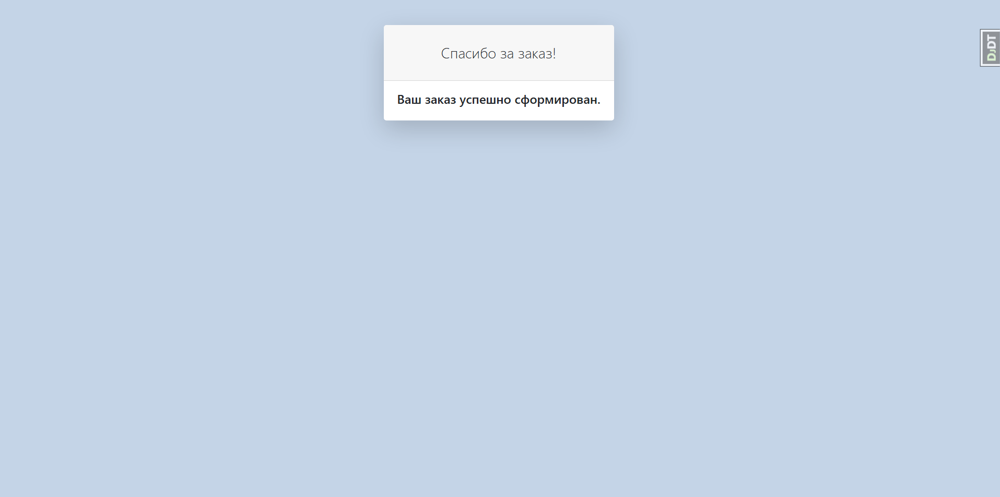     |
|    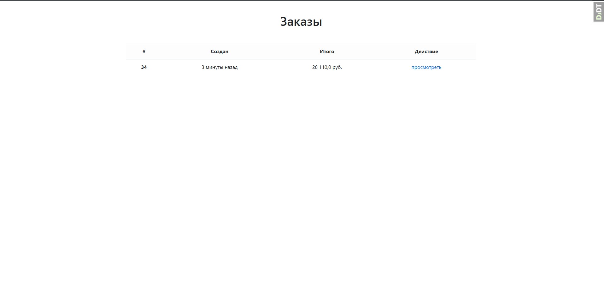    |
|     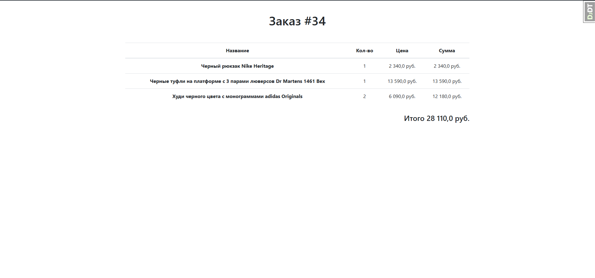     |

## Инструкция по запуску

Для запуска нужно скачать или клонировать [файлы из репозитория](https://github.com/Ghost845/django-store.git),
и запустить файл `manage.py`, используя редактор кода, поддерживающий язык программирования *Python*.
Перед запуском `manage.py`, для работы кэширования, отложенных задач и платёжной системы *Stripe*,
нужно запустить соответственно *Redis*, *Celery* и *Stripe*.

P.S. Чувствительная информация из settings.py вынесена в отдельный файл `.env`.
